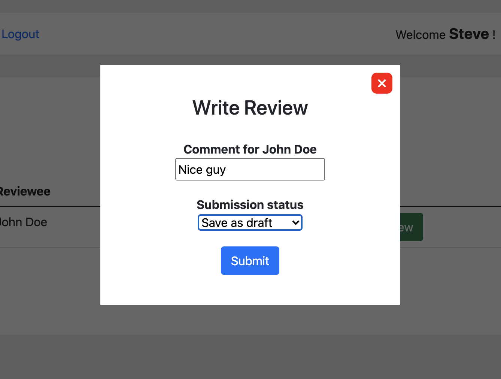

# Employee Review System

- This is a full stack web application that lets employees submit performance reviews for other employees
- Built with:
  - JavaScript
  - React
  - NodeJS
  - Express
  - CSS
  - MySQL
  - Sequelize
  - Docker

## Assumptions made

- This employee review system is meant to be viewed on desktop or tablet. Employees only use this system when they're at work on company issued devices.
- Only one reviewer and reviewee can be assigned per review
- Only the Admin user has access to the "Employee Management" and "Performance Reviews" dashboards.
- Each employee has to login separately to see what reviews they have due, so I made a login screen. This is a pseudo login process. There is no real password being registered. Any fake password will let you login.
- Reveiws can be set to "complete" or "incomplete" and can be modified by the Admin. A review will appear in an employee's homepage if the review is "incomplete"

# Environment Setup

### 1. Install dependencies

run the command `npm install` in both `client/` and `server/` directories

```
npm install
```

### 2. Install Sequelize

(from `server/` directory)

```
npm install -g sequelize-cli
```

### 3. Prepare Docker environment

- Install Docker daemon and Docker gui if you don't have them
- You can install Docker Desktop on Mac to confirm that Docker containers are running.

Docker daemon example (on Mac):

```
brew install docker
```

### 4. Create a MySQL database in Docker

```
$ docker run --name mysql -p 3306:3306 -e MYSQL_ROOT_PASSWORD=notpassword -d mysql:latest
```

\*change first port number if you have another db instance using 3306

### 5. Create Sequelize database

(from `server/` directory)

```
sequelize db:create
```

### 6. Start the server

(from `server/` directory)

```
npm run dev
```

### 7. Start the client

(from `client/` directory)

```
npm run start
```

### 8. Sign in as Admin (any password is OK)


### 9. Create Users (at least 2)


### 10. Create Reviews by assigning reviewers and reviewees


##


### 11. Logout as Admin and sign in as an employee (any password is OK)


### 12. FIll out the review with a comment and select "Ready to submit"



### 13. View the completion status of reviews from Advin view


